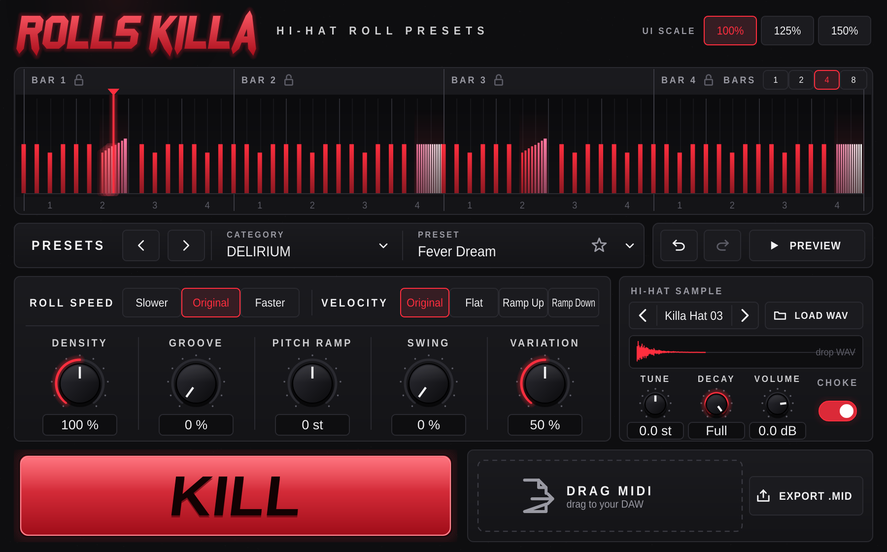

# ROLLS KILLA – Hi-Hat Roll Presets

Plugin ze série **Killa** (808 Killa, Keys Killa). Obsahuje knihovnu **96 trapových hi-hat rollů**
ve 12 kategoriích. Vybereš roll, ten hned hraje synchronně s DAW, pár knoby ho doladíš a buď hraje
z vestavěného sampleru, nebo ho přetáhneš jako MIDI do projektu.

- VST3 + Standalone (AU při buildu na macOS), instrument s MIDI výstupem
- C++17, JUCE 8.0.9 (stahuje se automaticky přes CMake), žádné další závislosti
- Návrh UI: `docs/design/main_window.webp`, `docs/design/preset_browser.webp`
- Zadání projektu: `CLAUDE.md`



## Instalace (Windows)

1. Zkompiluj projekt (níže) nebo si stáhni hotový build z GitHub Actions
   (záložka **Actions** → poslední běh **build** → artefakt `RollsKilla-Windows-VST3`).
2. Zkopíruj složku **`Rolls Killa.vst3`** do
   **`C:\Program Files\Common Files\VST3`**
3. Ve FL Studiu: *Options → Manage plugins → Find installed plugins*. Rolls Killa najdeš mezi
   generátory (Channel rack → **+**).

Standalone verze je `Rolls Killa.exe` (nastavení zvukové karty přes *Options*).

## Build

Potřebuješ CMake 3.22+, Git a Visual Studio 2022 nebo novější (workload *Desktop development with C++*).

```bat
cmake -S . -B build -G "Visual Studio 17 2022" -A x64
cmake --build build --config Release --parallel
ctest --test-dir build -C Release --output-on-failure
```

Pro Visual Studio 2026 použij generátor `"Visual Studio 18 2026"`. Alternativa s Ninja
(z *x64 Native Tools Command Prompt*):

```bat
cmake -S . -B build -G Ninja -DCMAKE_BUILD_TYPE=Release
cmake --build build
```

Výstupy najdeš v `build/RollsKilla_artefacts/Release/` (`VST3/Rolls Killa.vst3`, `Standalone/`).
Na Linuxu je potřeba `libasound2-dev libx11-dev libxrandr-dev libxinerama-dev libxcursor-dev
libfreetype-dev libfontconfig1-dev` (viz `.github/workflows/build.yml`).

## Hi-haty (Killa Drum Kit Vol.1)

Vlož `Killa_Hat_01.wav` až `Killa_Hat_14.wav` do `Resources/Samples/` a znovu spusť CMake a build.
Všechny WAV z té složky se zabalí do pluginu. Dokud tam nejsou, plugin používá syntetizované
zástupné closed hats (stejná jména, podobná délka a jas). Vlastní WAV lze kdykoli nahrát tlačítkem
**LOAD WAV** nebo přetažením na waveform.

## Jak se používá

| Ovládání | Co dělá |
|---|---|
| **PRESETS** (lišta) | klik otevře Preset Browser, ◀ ▶ = předchozí/další preset, ★ = oblíbené |
| **Preset Browser** | 12 kategorií + USER + FAVORITES, hledání, klik = načíst a hrát, ↑↓ listování, Enter, Esc, **SAVE** = uložit jako user preset |
| **Roll Visualizer** | klik na notu = mute, tažení nahoru/dolů = velocity, dvojklik na roll = rychlost (1/24 → 1/32 → 1/48 → 1/64 → 1/96), **pravý klik = smazat notu / smazat celý roll / obnovit vše**, zámek = takt, který KILL nemění, **BARS** 1/2/4/8 |
| **ROLL SPEED** | Slower / Original / Faster – posune rychlost všech rollů o krok |
| **VELOCITY** | Original / Flat / Ramp Up / Ramp Down (jen v rollech) |
| **DENSITY** | 100 % = originál, méně = ubírá rolly, víc = přidává krátké rolly na osminy |
| **GROOVE** | humanizace velocity |
| **PITCH RAMP** | −12 až +12 půltónů přes každý roll |
| **SWING** | 0–60 % (60 % = triolový feel) |
| **VARIATION** | jak moc **KILL** mění preset |
| **KILL** | nová variace presetu v pravidlech kategorie; pravý klik = zpět na originál presetu |
| **DRAG MIDI** | chyť a přetáhni do DAW (FL: do Playlistu nebo Piano rollu) |
| **EXPORT .MID** | uloží pattern jako MIDI soubor |
| **PREVIEW** | přehrávání v BPM presetu, když DAW stojí |
| **Undo/Redo** | posledních 20 změn (Ctrl+Z, Ctrl+Shift+Z) |

Všechno (preset, knoby, KILL seed, zámky, úpravy v okénku, sampler) se ukládá do projektu DAW.
User presety a oblíbené jsou v `%APPDATA%\Killa\Rolls Killa\`.

**MIDI výstup ve FL Studiu:** v okně Rolls Killa klikni na ozubené kolo (*Plugin wrapper settings*)
→ sekce **MIDI** → nastav **Output port** (např. 1). U nástroje, který má hrát (FPC, sampler, jiný VST),
nastav stejné číslo jako **Input port**. Noty jdou od C5 (MIDI 60), pitch rollu posouvá výšku noty.

## Testy a nástroje

- `ctest` spouští unit testy (knihovna 96 presetů + validace + statistika, PatternShaper, KILL,
  sampler, host sync, MIDI export, undo) a kontrolu celého procesoru (`RollsKillaRender --check`:
  uložení stavu, undo/redo, CPU).
- `RollsKillaRender <složka>` vyrenderuje každý preset do WAV přes skutečný procesor (poslech),
  `--demo` udělá jednu ukázku (preset 1 a 8 z každé kategorie), `--screenshot` uloží screenshot UI.
- `tools/midi_analyzer/analyze.py` – statistiky hi-hat MIDI (spusť na své `Documents\drumkits`).
- `tools/preset_authoring/` – zdroj továrních presetů (ručně psané, nic se nekopíruje z kitů).
- pluginval (strictness 10) prochází.

## Co vyzkoušet ručně (nejde automaticky)

1. **FL Studio – načtení:** přidej Rolls Killa jako generátor, otevři okno, přepni UI scale 125/150 %.
2. **Sync:** pusť Play v Pattern i Song módu, hlava ve visualizeru musí běžet s FL; zkus loop
   v Playlistu a skok kurzorem – noty nesmí viset ani se zdvojovat.
3. **Změna tempa uprostřed:** automatizuj tempo ve FL (např. 140 → 160) a poslouchej, že rolly drží grid.
4. **Presety:** projdi Preset Browser (šipkami), poslechni pár presetů z každé kategorie
   – hlavně jestli PRIMITIVUS zní jednoduše a BLAST RITUAL/MANIA šíleně, ale pořád trap.
5. **KILL + zámky:** zamkni takt 1, mačkej KILL – takt 1 se nesmí měnit; Ctrl+Z vrátí předchozí.
6. **Drag MIDI:** přetáhni do Playlistu i do Piano rollu, zkontroluj délku (počet taktů) a tempo.
7. **MIDI out:** nastav port (viz výše) a ověř, že druhý nástroj hraje stejný pattern.
8. **Uložení projektu:** ulož, zavři FL, otevři – preset, KILL, zámky a úpravy musí zůstat.
9. **Vlastní WAV:** přetáhni WAV na waveform, ulož projekt a znovu otevři.
10. **Ableton Live:** stejný test 1–3 a 6 (instrument track, MIDI out přes *MIDI From* na jiné stopě).

## Struktura

```
Source/
  PluginProcessor.*        audio + MIDI, parametry (APVTS), host sync, stav, undo
  PluginEditor.*           UI (900×560, škálování 100/125/150 %)
  Parameters.*             ID a rozsahy parametrů
  engine/                  bez GUI, testovatelné:
    Pattern                noty v dobách, detekce/vkládání rollů, tiling na takty
    CategoryProfile        hudební profil 12 kategorií (sekce 3.3 zadání)
    RollLibrary            tovární presety (JSON v BinaryData), user presety, favorites, hledání
    PresetValidator        pravidla presetů + statistika knihovny
    PatternShaper          knoby (speed, density, velocity, groove, pitch, swing)
    VariationEngine        KILL (deterministická variace podle seedu, zámky taktů)
    RollModel              preset → takty → KILL → úpravy → knoby
    HatSampler, HatSynth   sampler s choke, zástupné hajtky
    PatternPlayer          sample-accurate přehrávání podle PPQ hostu
    MidiExport             .mid export + drag & drop
    LockFreeSlot, UndoHistory
  ui/                      look & feel, logo a sigily (vektorově), visualizer, browser, widgety
Resources/Presets/Factory  96 továrních presetů (JSON)
Resources/Samples          sem patří Killa_Hat_01–14.wav
Tests/                     JUCE UnitTest
tools/                     analyzer, autorský skript presetů, renderer
```
